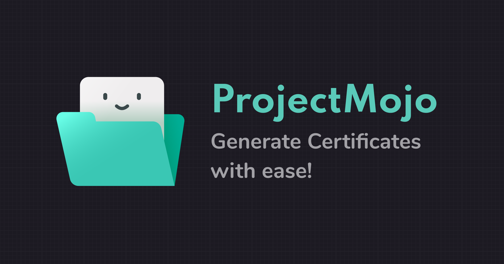

# ProjectMojo

Try it out here: [:link: project-mojo-demo.herokuapp.com](http://project-mojo-demo.herokuapp.com/)

## Table of contents:

- [ProjectMojo](#projectmojo)
  - [Table of contents:](#table-of-contents)
  - [Guides](#guides)
- [Features](#features)
  - [Custom Templates](#custom-templates)
  - [Customization](#customization)
  - [Live Editor](#live-editor)
  - [Batch Generation](#batch-generation)
  - [Pre Existing and Public templates](#pre-existing-and-public-templates)
  - [Mobile friendly](#mobile-friendly)
- [Additional links](#additional-links)
- [Installation and setup](#installation-and-setup)
  - [Backend](#backend)
    - [Installation for Manjaro/Arch](#installation-for-manjaroarch)
    - [Running the backend](#running-the-backend)
  - [Frontend](#frontend)
  - [Misc Handy Commands](#misc-handy-commands)
- [Analytics](#analytics)

Each application built should do one thing, and it should do that thing very well.

Project Mojo does one thing: It generates bulk media from SVG files.

You can upload any template that you desire, or use any of the pre-existing ones. Choose the variables that need to be substituted, tweak the colors, fonts, and the images and generate batch media with CSVs.

The lack of code involved makes it simple for anyone to generate high quality bulk media easily. Also, the availability of API keys in the form of JWT means that it can be integrated in complex workflows where automation is the norm. From uploading the templates to rendering the images, all can be achieved via the API as well.

## Guides

You can checkout these videos for a demo of the application:

- [ProjectMojo - Upload a Template](https://www.youtube.com/watch?v=q4dVv2-3XfM)
- [ProjectMojo - Generate a Post for Instagram](https://www.youtube.com/watch?v=NZgB4r5batc)
- [ProjectMojo - Generate Multiple Certificates from CSV](https://www.youtube.com/watch?v=tQ8OsDh_534)

# Features

## Custom Templates

The user can upload any SVG templates that they want to use to generate the media that they require. The templating system is very similar to several web dev platforms. It uses the curly brackets `{{variable}}` to specify the variables that can be replaced and iterated over.

## Customization

**Fonts**: The backend server has all of the google fonts installed so any of those can be used for rendering for fonts.

**Colors**: The color palette of three colors is used to offer customization in terms of colors. The specific number was chosen as most templates usually have one or two primary colors with an accent color and these are the ones that people want to change. As these colors are hex values, these can be used to even style the gradients!

**Images**: Apart from fonts and colors, you can replace images in the template, currently three forms of images are defined in the templates:

- Logo - This reflects the company/organization logo
- Placeholder - Can be any image in the foreground
- Background - The background of a template

As the application is open sourced, these predefined values can be configured to your needs if you may want to do so.

## Live Editor

The editor in the frontend allows you to apply customizations with just a simple refresh without querying the backend. This makes it easier to tweak the templates to your heart's desire before rendering the final images.

## Batch Generation

You can generate a single SVG by providing the values for the variables in the template. But the real fun starts when you upload a CSV and select the columns to choose the values from. The app then generates the required media for each of the rows of the CSV and zips them into a nice archive for you. All customizations available for the single generation are also available for the batch one too.

## Pre Existing and Public templates

We understand that not everyone is a designer but at we all need nice looking templates that we can use as soon as possible without much hassle. Thus there are several templates that match different needs available already with the app, so you can go creative and generate any variations of the pre-existing templates.

And if you are a good designer, you can even make your templates public so that people can utilize your mastery to generate beautiful media.

## Mobile friendly

The entire app is responsive and can be used on the mobile so you can create media on the go, with no need to reach for a laptop to get a professional looking template/editor.

# Additional links

- [Template Guide](template_guide.md) - Detailed spec of the templates, guidelines to follow while making a custom template.
- [Knowledgebase](knowledge_base.md) - Interesting solutions to a few technical problems encountered with the development of the Project.

# Installation and setup

## Backend

Install the JVM and clojure for your OS respectively.

Also install [lein](https://leiningen.org/).

For the DB install postgresql and create a DB with name `project_mojo`.

For svg processing the `libsvg` package is also needed.

### Installation for Manjaro/Arch

Clojure:

```bash
curl -O https://download.clojure.org/install/linux-install-1.10.1.763.sh
chmod +x linux-install-1.10.1.763.sh
sudo ./linux-install-1.10.1.763.sh
```

You can also install `clojure` via pamac. `leiningen` is also available via the pamac installer or through pacman.

Install Docker and start the service with:

You may also need to relogin if you add your user to docker user group.

```bash
sudo pacman -S docker
systemctl enable docker.service
systemctl start docker.service
groupadd docker
gpasswd -a <username> docker
```

`librsvg` is installed by default as it is required by other packages but can also be explicitly installed via pamac or pacman.

Install heroku-cli:

```bash
yay -S heroku-cli
```

### Running the backend

In the `project-mojo-backend` directory run `lein`, this will install the clojure dependencies.

To run the backend, setup the postgres URL as

`export DATABASE_URL="postgresql:///project_mojo"` in your shell.

To start the backend server you can either:

- Run `lein run` in the shell after setting up the DB.
- Run `lein repl` and connect to the project, and use `(-main)`.

The backend runs at `http://localhost:5000`.

For development on VSCode:

- Use `Calva` plugin.
- You can connect to the repl that you have started in shell to VSCode and have access there.
- Do note that you need the DB url set in the shell to run backend. Thus starting the repl directly via VSCode might not work if you have not set the variable globally, (which is a bad idea.)

**DB Migrations**

Migrations can be ruin through:

- Shell by running: `lein run migrate`
- Via repl through `(migrate)`

Migrations can be created through repl by running `(create-migration "<migration name>")`. This will create 2 migrations files (up and down) in the `project-mojo-backend/resources/migrations` directory from where you can add the SQL statement run to do the changes and undo the changes. Note that only a single statement is allowed to keep the migrations atomic.

Migrations on the deployed instance can be run by setting the DB url to the one set in the server and then running migrations on it.

**Structure**

- The endpoints are present in the `project-mojo-backend/src/clj/project_mojo_backend/routes/services.clj`
- The related functions to each resource, for example, users, templates etc are present with their name at `project-mojo-backend/src/clj/project_mojo_backend/<name>.clj`
- We use [`hugsql`](https://www.hugsql.org/#detail) to write the SQL queries directly to interact with the DB. The sql file is present at: `project-mojo-backend/resources/sql`. The file is processed by `project-mojo-backend/src/clj/project_mojo_backend/db/core.clj` to create the appropriate functions for accessing the DB.
- Auth for login is basic, the subsequent requests are authorized via JWT. Due to opinionated JWT library, we have `Token <jwt>` rather than the more common `Bearer <jwt>` auth header format.

**Deployment**

Ensure Docker is installed. And you are logged in to heroku cli.

`./build.sh` script builds and deploys the files to project to heroku. It will build the frontend to: `project-mojo-backend/resources/frontend_dist`. If there are files from previous deployment, you may need to remove them.

Heroku logs for the deployed project can be accessed via: `heroku logs -a projectmojo`.

## Frontend

Use `yarn` in `project-mojo-frontend` to install the dependencies and `yarn start` to start the live dev server.

You should also run the backend server while development to test out and work on frontend code.

The frontend runs at `http://localhost:3000`.

The deployment of frontend is also handled via the `./build.sh` script.

## Misc Handy Commands

Run docker locally
`docker build . -t project_mojo`
`docker run -p 5000:5000 --env-file=.env project_mojo`

# Analytics

Events other than page views being tracked:

1. `event("upload", "csv")` - The uploading of a CSV is tracked with this event.
2. `event("media_download_batch", template_id)` - Batch Download of batch template with template ID.
3. `event("media_download_single", template_id)` - Single Download of batch template with template ID.
4. `event("customization", "switched")` - If a user switches to customization.
5. `event("test_template_upload", "test")` - If a user tests the uploaded template in the test available below the form.
